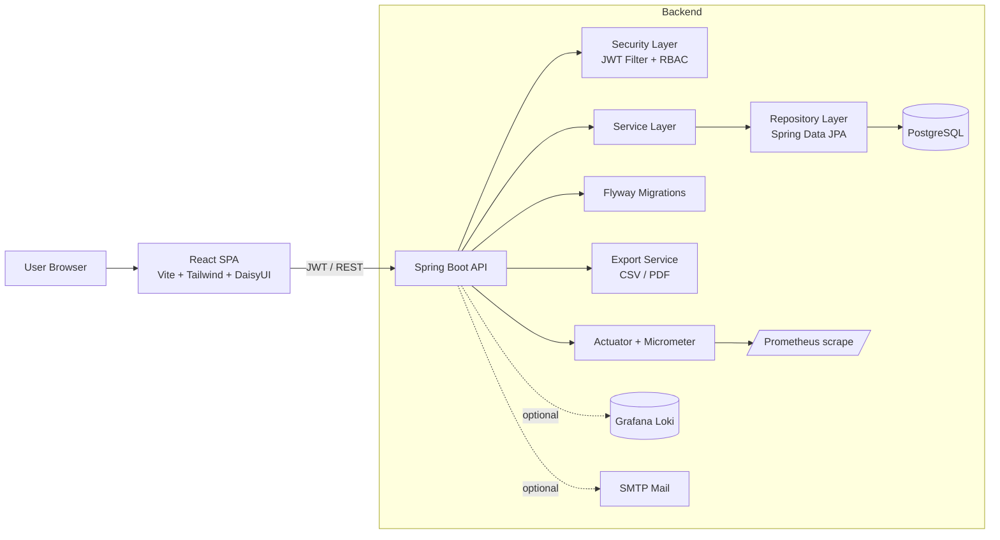

# Tasque Manager


Fullstack task manager: Spring Boot API + React SPA.

## Architecture



## Stack

- Backend: Java 17, Spring Boot 3.3, Spring Security (JWT), Spring Data JPA, Flyway, PostgreSQL, Micrometer/Prometheus, Logback + Loki appender
- Frontend: React 18, Vite, Tailwind CSS, DaisyUI, react-beautiful-dnd
- Testing: JUnit 5 + Mockito + MockMvc, Jest + React Testing Library

## Main Features

- Auth (JWT access + refresh)
- Tasks CRUD with filtering, sorting, pagination
- Dark mode UI
- Create/edit task in modal windows
- Kanban drag-and-drop between statuses
- Overdue progress visualization
- Task comments with `@mentions`
- File attachments (upload/download)
- Notifications (in-app, plus optional email channel)
- Export tasks to CSV/PDF

## Observability

- Spring Actuator enabled
- Prometheus endpoint: `/actuator/prometheus`
- HTTP metrics with percentiles, including p99
- Optional Loki shipping via `LOKI_URL`

## Project Structure

```text
backend/
  src/main/java/com/example/taskmanager
  src/main/resources
frontend/
  src/
```

## Database Migrations

`backend/src/main/resources/db/migration`

- `V1__create_tasks.sql`
- `V2__add_indexes.sql`
- `V4__add_priority.sql`
- `V5__add_task_fields.sql`
- `V6__comments_attachments_notifications.sql`

Seed data:

- `backend/src/main/resources/db/seed/R__seed_tasks.sql`

## Run Locally

### 1) Database

```bash
docker-compose up -d db
```

### 2) Backend

```bash
cd backend
mvn clean spring-boot:run
```

Required env for postgres profile:

- `SPRING_PROFILES_ACTIVE=postgres`
- `SPRING_DATASOURCE_URL`
- `SPRING_DATASOURCE_USERNAME`
- `SPRING_DATASOURCE_PASSWORD`
- `APP_JWT_SECRET`

### 3) Frontend

```bash
cd frontend
npm install
npm run dev
```

## Testing

Backend:

```bash
cd backend
mvn test
mvn verify
```

Frontend:

```bash
cd frontend
npm install
npm test
```

Coverage (latest local run):

- Backend JaCoCo LINE: `62.43%`
- Frontend Jest global: lines `77.77%`, branches `51.72%`, functions `60%`, statements `77.77%`

## API Docs

- Swagger UI: `/swagger-ui.html`
- OpenAPI: `/v3/api-docs`

## License

MIT, see `LICENSE`.